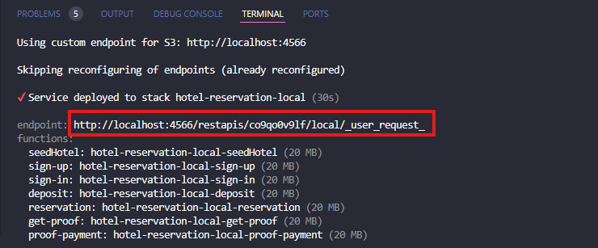
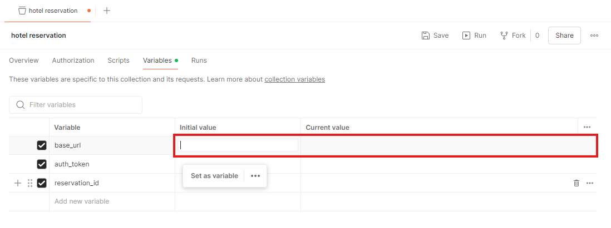
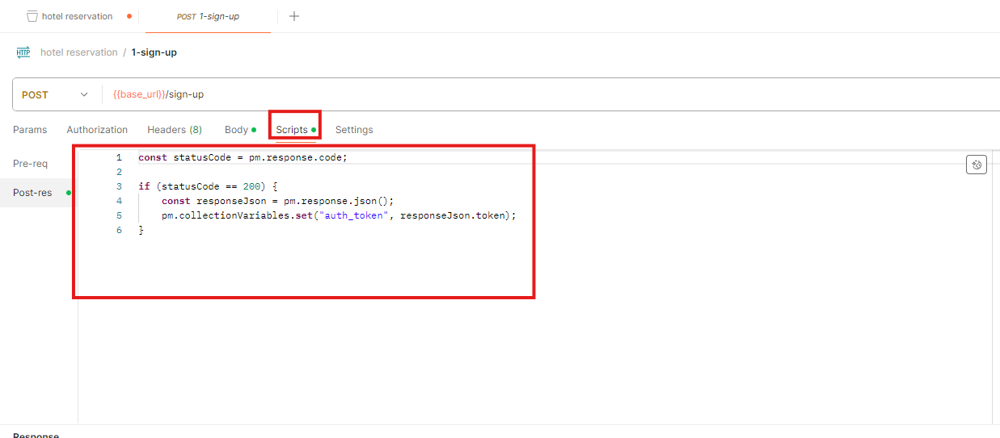
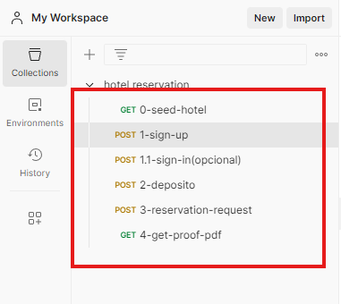
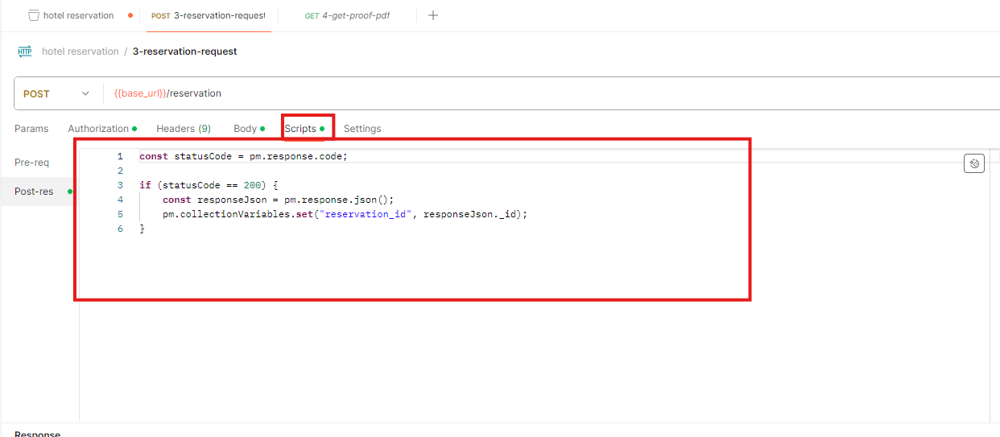

# Hotel Reservation Service

Este repositório contém o serviço de reserva de hotel, implementado utilizando Serverless Framework e LocalStack para simulação dos serviços da AWS localmente.

## Pendências e Falhas nos Requisitos

- **Endpoint para Recebimento de Comprovantes de Pagamento/Depósito**:
  Não foi criado um endpoint específico para receber comprovantes de pagamento ou depósito. Se essa funcionalidade fosse implementada, provavelmente o documento não seria recebido diretamente pelo servidor back-end. Em vez disso, seria criado um endpoint que geraria uma URL pré-assinada de PUT. Essa URL seria utilizada pelo front-end para salvar o documento diretamente no S3, evitando o trânsito do arquivo pelo servidor back-end.

- **Desconto de Saldo no Check-in**:
  Descontar o saldo apenas no momento do check-in não parecia uma abordagem adequada, pois isso poderia gerar uma desvantagem significativa para o hotel. Clientes poderiam fazer reservas e não comparecer ou pagar, causando prejuízos ao hotel.

## Requisitos Mínimos

Para rodar este serviço localmente, você precisará garantir que os seguintes requisitos estejam atendidos:

### 1. AWS CLI v2

Você deve ter o AWS CLI v2 instalado. Se ainda não tiver instalado, siga as instruções [aqui](https://docs.aws.amazon.com/cli/latest/userguide/install-cliv2.html) para a instalação.

### 2. Docker

O Docker deve estar instalado e rodando em sua máquina para que o LocalStack possa ser executado. Você pode instalar o Docker seguindo as instruções [aqui](https://docs.docker.com/get-docker/).

### 3. Serverless Framework

O Serverless Framework deve estar instalado em sua máquina. Você pode instalar o Serverless Framework seguindo as instruções [aqui](https://www.serverless.com/framework/docs/getting-started).

### 4. Configuração do AWS CLI

Você precisará configurar o AWS CLI para que ele use o LocalStack em vez dos serviços reais da AWS.

1. **Arquivo `~/.aws/config`**

   Crie ou edite o arquivo `~/.aws/config` com o seguinte conteúdo:

   ```ini
   [default]
   region = us-east-1
   output = json
   endpoint_url = http://localhost:4566
   ```

2. **Arquivo `~/.aws/credentials`**

   Crie ou edite o arquivo `~/.aws/credentials` com o seguinte conteúdo:

   ```ini
   [default]
   aws_access_key_id = test
   aws_secret_access_key = test
   ```

### 5. Como Rodar o Serviço

Após garantir que todos os requisitos acima estão atendidos, siga os passos abaixo para rodar o serviço localmente:

1. **Clone o Repositório**

   ```bash
   git clone https://github.com/joelgon/hotel-reservation.git
   cd hotel-reservation
   ```

2. **Variaveis de ambiente**

   Crie um arquivo `.env` na raiz do projeto e cole os valores que estão no `.env.example`
   ```bash
    MONGO_URI=mongodb://mongo1:27017,mongo2:27017,mongo3:27017/hotel_reservation?replicaSet=rs0&authSource=admin
    QUEUE_URL=http://sqs.us-east-1.localhost.localstack.cloud:4566/000000000000/
    S3_ENDPOINT=http://s3.us-east-1.localhost.localstack.cloud:4566
   ```

3. **Instale as dependencias**

   ```bash
   npm i
   ```

4. **Suba o Ambiente Local com Docker Compose**

   ```bash
   docker-compose up
   ```

5. **Implante a Aplicação com Serverless**

   ```bash
   npm run deploy:local
   ```

6. **Acesse o Mongo Express (Opcional)**

  Se precisar acessar o MongoDB visualmente, você pode utilizar o Mongo Express acessando http://localhost:8081 no navegador.
  | Username | Password |
  | :------: | :------: |
  | mexpress | mexpress |

### Url base das lambdas

Após o deploy será gerada uma url conforme a imagem abaixo indica



### Segue a collection completa
[][1]

### Explicação da collection

1. **Cole a url nas variaveis da collection**

   Cole a url em Initial value e Current value

   

2. **Login e Cadastro**

   Ao realizar login ou cadastro o token de acesso será salvo nas variaveis de ambiente devido o script de test no postman

   

3. **Ordem do fluxo feliz**

   A Collection ja esta em ordem de cima para baixo, porém as request tb foram nomeadas com numeros em ordem crescente

   

4. **Reserva**

   Após fazer uma reservar **"3-reservation-request"** o `_id` da reserva será salvo nas variaveis da collection para ser usado em **"4-get-proof-pdf"**

   

### Considerações finais

1. **Pessimistic locking**

   O Mongodb não oferece suporte nativo a `Pessimistic locking` foi implementado uma solução paleativa com a criação de um schema **lock-item**
   o qual recebe apenas um _id sendo o _id do item q deseja travar dado que é um index unico e não sera duplicado, o problema dessa solução
   é que simplemente será lançado uma exeção se o item já estiver travado, diferente do banco relacional que tem o comportamento de esperar o item ser liberado.

   Por que não utilizei o `Optimistic locking`? Esse tipo de lock considera que não terá alta concorrencia pelo recurso, e uma de suas principais falhas é justamente
   não garantir integridade em um ambiente com alta concorrencia, talvez seu uso seja valido em um cenario com fila SQS e menssagens com groupId definido para tentar  diminuir a concorrencia pelo recurso.

2. **Url pré-assinada**

   Todos os documentos gerados seram salvos no **bucket privado** `proof-payment`, ao invés de buscar o documento no **S3** e devolver um `buffer` na request optei
   por gerar uma url pré-assinada com duração de **60 segundo**

[1]: https://github.com/joelgon/hotel-reservation/releases/download/1/hotel.reservation.postman_collection.json
